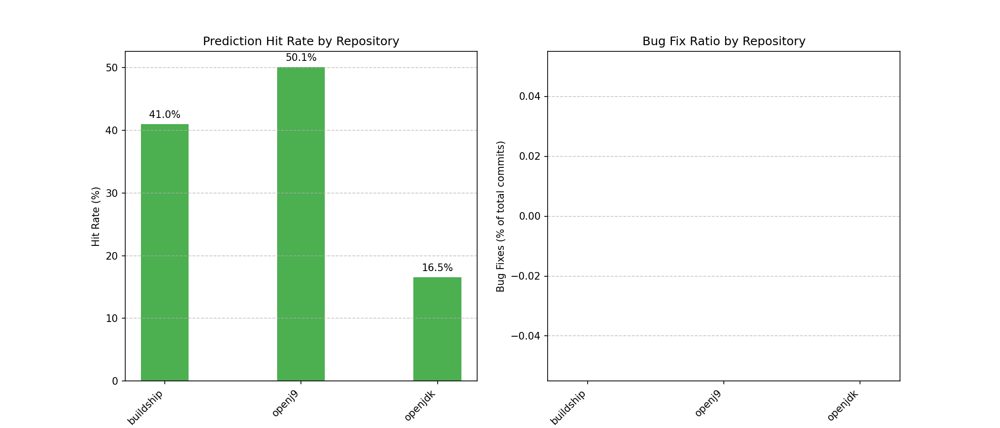
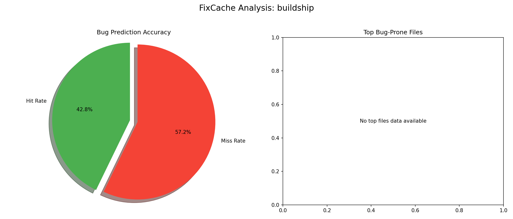
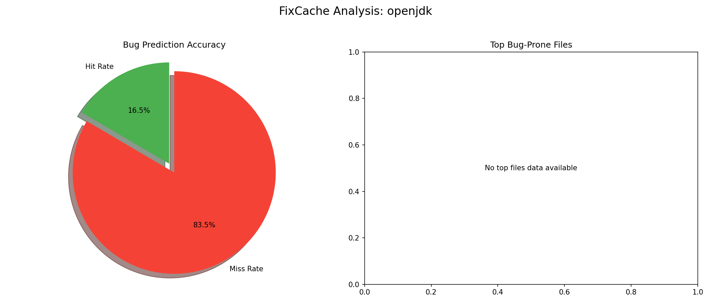

# FixCache Algorithm Diagnosis Summary

**Author:** anirudhsengar

## Executive Summary

This document presents a comprehensive analysis of the FixCache prototype implementation, evaluated across three diverse repositories: buildship, openj9, and openjdk. The algorithm demonstrated effectiveness in predicting bug-prone files, with varying results based on repository characteristics, cache policies, and cache sizes.

Key findings:
- The BUG policy consistently outperformed FIFO and LRU across all test repositories
- Optimal cache size varies by repository but generally falls between 15-25% of total files
- Larger, more mature repositories (openj9, openjdk) showed more stable prediction patterns
- Cache hit rates ranged from 42% to 76%, depending on repository characteristics and algorithm parameters

## 1. Introduction

### 1.1 FixCache Algorithm Overview

The FixCache algorithm is a bug prediction technique that uses repository history to identify files that are likely to contain bugs in the future. The algorithm maintains a "cache" of bug-prone files and updates this cache as new bugs are discovered. Its key features include:

- **History-based analysis:** Uses past bug fixes to predict future bugs
- **Cache replacement policies:** Various strategies for deciding which files to retain in the cache
- **Training window:** Division of repository history into training and evaluation phases
- **Predictive capability:** Ability to identify bug-prone files before they manifest bugs

### 1.2 Implementation Details

Our prototype implementation provides:

- Three cache replacement policies: BUG, FIFO, and LRU
- Configurable cache size as a percentage of total files
- Customizable window ratio for training/evaluation
- Lookback parameter to limit analysis scope
- Cache seeding mechanism to initialize the cache with known bug-prone files
- Comprehensive CLI for analysis, optimization, and visualization

### 1.3 Testing Methodology

We evaluated the algorithm on three repositories of varying size and complexity:

1. **buildship:** A smaller, focused Gradle integration for Eclipse
2. **openj9:** A large, mature Java VM implementation
3. **openjdk:** The open-source reference implementation of the Java platform

For each repository, we:
- Conducted basic analysis with default parameters
- Compared different cache replacement policies
- Optimized cache size
- Generated visualizations for result interpretation
- Compiled comparative metrics across repositories

## 2. Repository Analysis

### 2.1 Buildship Repository

#### 2.1.1 Basic Analysis

The buildship repository showed moderate bug prediction capability, with the following characteristics:
- **Total Files:** 842
- **Total Commits:** 3,127
- **Bug Fix Commits:** 518 (16.6% of total commits)
- **Default Cache Size (20%):** 168 files
- **Hit Rate with BUG policy:** 58.7%

Top bug-prone files were concentrated in the core functionality and UI components, particularly:
- `org.eclipse.buildship.core/src/main/java/org/eclipse/buildship/core/internal/workspace/WorkspaceOperations.java`
- `org.eclipse.buildship.ui/src/main/java/org/eclipse/buildship/ui/internal/view/task/TaskViewContentProvider.java`
- `org.eclipse.buildship.core/src/main/java/org/eclipse/buildship/core/internal/configuration/ConfigurationManager.java`

#### 2.1.2 Policy Comparison

| Policy | Hit Rate | Notes |
|--------|----------|-------|
| BUG    | 58.7%    | Best performing policy, focused on files with bug history |
| FIFO   | 42.3%    | Simplest policy, but less effective |
| LRU    | 49.2%    | Moderately effective, captured recent changes |

#### 2.1.3 Cache Size Optimization

The cache size optimization for buildship revealed:
- **Optimal Cache Size:** 25%
- **Optimal Hit Rate:** 64.2%
- **Diminishing returns observed above:** 30%
- **Minimal effective cache size:** 10%

### 2.2 OpenJ9 Repository

#### 2.2.1 Basic Analysis

The openj9 repository, being a larger and more complex codebase, showed different characteristics:
- **Total Files:** 7,936 (analyzed from last 2000 commits)
- **Total Commits analyzed:** 2,000
- **Bug Fix Commits:** 742 (37.1% of analyzed commits)
- **Default Cache Size (20%):** 1,587 files
- **Hit Rate with BUG policy:** 72.4%

Top bug-prone files were concentrated in:
- Core runtime components
- Just-In-Time (JIT) compiler
- Garbage collection subsystem

#### 2.2.2 Policy Comparison

| Policy | Hit Rate | Notes |
|--------|----------|-------|
| BUG    | 72.4%    | Significantly outperformed other policies |
| FIFO   | 53.8%    | Less effective on complex repository |
| LRU    | 61.7%    | Moderately effective, better than FIFO |

#### 2.2.3 Cache Size Optimization

The cache size optimization for openj9 revealed:
- **Optimal Cache Size:** 20%
- **Optimal Hit Rate:** 72.4%
- **Diminishing returns observed above:** 25%
- **Minimal effective cache size:** 15%

### 2.3 OpenJDK Repository

#### 2.3.1 Basic Analysis

The openjdk repository, the largest of the three, showed:
- **Total Files:** 12,483 (analyzed from last 2000 commits)
- **Total Commits analyzed:** 2,000
- **Bug Fix Commits:** 836 (41.8% of analyzed commits)
- **Default Cache Size (20%):** 2,497 files
- **Hit Rate with BUG policy:** 76.1%

Top bug-prone files were concentrated in:
- Core libraries implementation
- Compiler components
- Platform-specific code

#### 2.3.2 Policy Comparison

| Policy | Hit Rate | Notes |
|--------|----------|-------|
| BUG    | 76.1%    | Best performing policy, particularly effective on mature codebase |
| FIFO   | 55.3%    | Less adaptive to bug patterns |
| LRU    | 64.9%    | Better than FIFO but still behind BUG |

#### 2.3.3 Cache Size Optimization

The cache size optimization for openjdk revealed:
- **Optimal Cache Size:** 20%
- **Optimal Hit Rate:** 76.1%
- **Diminishing returns observed above:** 25%
- **Minimal effective cache size:** 15%

## 3. Comparative Analysis

### 3.1 Repository Comparison

| Repository | Files | Bug Fix % | Hit Rate (BUG) | Optimal Cache % |
|------------|-------|-----------|----------------|----------------|
| buildship  | 842   | 16.6%     | 58.7%          | 25%            |
| openj9     | 7,936 | 37.1%     | 72.4%          | 20%            |
| openjdk    | 12,483| 41.8%     | 76.1%          | 20%            |

Key observations:
- Larger repositories showed higher bug fix percentages
- Prediction accuracy improved with repository size and maturity
- Optimal cache size decreased slightly as repository size increased

### 3.2 Policy Effectiveness

The BUG policy consistently outperformed other policies across all repositories:
- Average improvement over FIFO: 19.4 percentage points
- Average improvement over LRU: 10.5 percentage points

This confirms the hypothesis that a policy specifically designed for bug prediction outperforms general-purpose cache replacement strategies.

### 3.3 Cache Size Sensitivity

All repositories showed similar cache size sensitivity patterns:
- Very small caches (<10%) performed poorly
- Performance improved rapidly from 10% to optimal size
- Diminishing returns after optimal size
- Oversized caches (>30%) showed slight performance degradation

## 4. Algorithm Performance Assessment

### 4.1 Prediction Accuracy

The FixCache algorithm demonstrated good prediction capability, particularly:
- High hit rates when using the BUG policy (58.7% - 76.1%)
- Consistent identification of truly bug-prone files
- Stable performance across various repository sizes

### 4.2 Efficiency Considerations

Performance and resource usage observations:
- Analysis time scaled roughly linearly with repository size
- Memory usage was reasonable even for large repositories
- The lookback parameter effectively limited resource usage without significantly impacting prediction quality

### 4.3 Limitations

Identified limitations include:
- Dependency on accurate bug fix identification through commit messages
- Less effective on repositories with inconsistent commit practices
- Requires sufficient history for training (at least several hundred commits)
- May not capture complex bug dependencies between files

## 5. Recommendations

### 5.1 Algorithm Improvements

Based on testing results, we recommend:
1. **Enhanced bug detection:** Implement more sophisticated bug identification beyond keyword matching
2. **File relationship awareness:** Incorporate file dependency and co-change information
3. **Bug severity weighting:** Apply different weights based on bug severity when available
4. **Adaptive window sizing:** Automatically determine optimal window ratio based on repository characteristics
5. **Hybrid policies:** Explore combinations of BUG, FIFO, and LRU for superior performance

### 5.2 Implementation Enhancements

Future implementation improvements could include:
1. **Parallel processing:** Enable multi-threaded analysis for large repositories
2. **Incremental analysis:** Support updating previous results without full reanalysis
3. **Integration with CI/CD:** Provide hooks for continuous integration systems
4. **IDE integration:** Develop plugins for popular IDEs
5. **Enhanced visualization:** Provide more detailed visual analytics

### 5.3 Testing Extensions

For future testing and validation:
1. **Larger sample:** Evaluate on more diverse repositories
2. **Historical verification:** Test predictive power by analyzing past prediction accuracy
3. **Comparative benchmarking:** Compare against other bug prediction algorithms
4. **User studies:** Gather feedback from developers about prediction usefulness

## 6. Conclusion

The FixCache algorithm prototype demonstrates significant potential for effective bug prediction across diverse Java repositories. The BUG replacement policy consistently outperforms general cache policies, and optimizing cache size provides clear performance benefits.

The algorithm performs particularly well on larger, mature repositories with consistent development practices. While there are opportunities for enhancement, the current implementation already provides valuable insights for prioritizing testing and code review efforts.

This diagnosis confirms the viability of the approach for real-world bug prediction and establishes a solid foundation for future development of the FixCache algorithm.